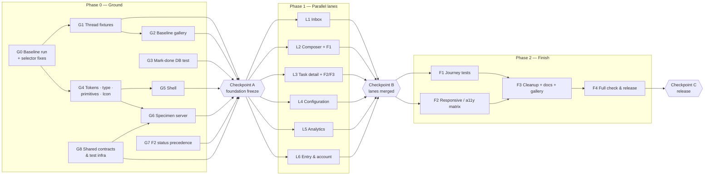

# Bellows redesign — execution graph

Date: 2026-09-26. Companion to [IMPLEMENTATION-PLAN.md](IMPLEMENTATION-PLAN.md) (rev. 2). The plan says **what** to build;
this file says **in what order, by how many executors in parallel, and who owns which file**. Section references like
§3.1 point into the implementation plan.

Shape: **Phase 0: Ground** (2 agents, mostly serial) → **Checkpoint A** → **Phase 1: Lanes** (6 agents in parallel,
isolated worktrees) → **Checkpoint B** → **Phase 2: Finish** (1–2 agents, serial) → **Checkpoint C / release**.

Estimated wall-clock: **≈11–14 working days**, against ≈24–31 focused days of serial effort (per-node sum in
IMPLEMENTATION-PLAN §4).

---

## 1. Graph



Hard dependencies only. G3, G7 and G8 have no inbound edges: they start on day 1 alongside G0.

---

## 2. Phase 0 — Ground work

Goal: everything that more than one lane would otherwise touch lands **once**, before any lane starts. After
Checkpoint A, lanes never edit the design tokens, the shell, the status derivations, the Playwright config or the
shared fixtures.

Two executors: **Ground-A** (visual foundation, critical path) and **Ground-B** (contracts and logic).

| Node | Owner | Content (plan ref) | Depends on | Est. | Exit check |
| --- | --- | --- | --- | --- | --- |
| **G0** Baseline run | Ground-A | R0.1: run `verify:ui` on a worktree pinned to `e19fce1` (G7 lands on `main` the same day and would change the numbers), write `baseline/RESULTS.md`, fix stale native-`<select>` selectors | — | 0.5–1 d | RESULTS.md with real numbers; selector fixes green |
| **G1** Thread fixtures | Ground-B | R0.2: `e2e/fixtures/threads.ts` (all states incl. terminal parked wait, done over open wait, other/null author); refactor `task-detail.spec.ts` mocks onto it | G0 (needs a green spec to refactor) | 0.5 d | `task-detail.spec.ts` green on fixtures |
| **G2** Baseline gallery | Ground-B | R0.3: `e2e/baseline.spec.ts`, every route × theme × {1440, 390} + manifest. **Must capture the old UI:** run it in a worktree pinned to `e19fce1` with only the test-only commits cherry-picked on top (G0 selector fixes, G1 fixtures, the spec itself). **No** G4/G5/G7 code may be in that tree. | G0, G1 (test-only commits) | 0.5 d | `baseline/` gallery + manifest committed; manifest's commit field shows the pinned base |
| **G3** Mark-done DB test | Ground-B | §3.2: parked wait → Mark done → review event → sweep → no wake, plus a control case | — | 0.25 d | `npm run test:db` green |
| **G4** Foundation | Ground-A | **Commit 1:** the `styles.css` / `design-system.md` region scaffolding (§2.1 item 7, moved here from G8 because it rewrites the same files), including moving the 44px touch-target rule (and its 900px media block) into a `shared: touch targets` block outside all lane regions (plan §0 rule 6). **Then** R1.1–4 + R1.7: both `:root` blocks (§1.1), `--radius-xl`, type (§1.3, drop Semi Condensed), primitives (§1.5: buttons, `.field`, `pill` tones, banners, chip, kbd, avatar, dialog), `Icon.tsx` (§1.6), polish.spec composite contrast probe, design-system.md tokens/primitives | G0 | 1.5–2 d | `styles.test.ts`, `theme.test.tsx`, `polish.spec.ts` green both themes |
| **G5** Shell | Ground-A | R1.5 / §2.1: 224px sidebar, 56px bar, nav icons, Tasks review-count pill, single collapsible preview, Settings Overview item, drawer restyle | G4 | 1 d | `shell`, `nav-model`, `mobile-nav`, `sidenav` tests; `navigation.spec.ts` |
| **G6** Specimen server | Ground-B | §1.7: `e2e/specimen/*`, second webServer + `specimen` project, `specimen.spec.ts`, PNGs to `specimen/` | G4 (primitives), G8 (port scheme) | 0.5–1 d | 4 specimen PNGs committed |
| **G7** F2 precedence | Ground-B | §3.2 "Delivery": `taskStatusLabel`, `taskTone`, `taskDotClass` on tone, `isWaitingForReview` closure check, `.sidenav-dot-review` rule, tests, `docs/jobs.md` | — | 0.5 d | `task-tree`, `sidenav`, `task-outcome.render` tests green |
| **G8** Shared contracts & test infra | Ground-B | See §2.1 below | — | 0.5–1 d | typecheck, lint, `npm test`, two lanes' `verify:ui` runs in parallel without collision |

### 2.1 G8 in detail — what exists to prevent lane collisions

1. **Parallel-safe e2e.** `playwright.config.ts` hardcodes ports 8123/8124/8125 and databases `factory_e2e` /
   `factory_auth_e2e`. Two lanes running `verify:ui` on one machine would kill each other's servers and reset each
   other's data. Make them env-driven:
   - `E2E_PORT_BASE` (default 8123): the app, auth app, stub IdP and specimen ports all derive from it (+0, +1, +2, +3).
   - `E2E_DB_PREFIX` (default `factory`): databases become `${prefix}_e2e` and `${prefix}_auth_e2e`. This keeps the
     `_e2e` suffix that the disposable-DB guards require.
   - `e2e/reset-db.mjs` and `e2e/stub-idp.mjs` read the same variables.
   - `AUTH_PORT` is **exported** from `playwright.config.ts` (`:16`) and imported by specs. Keep the export, derived from
     the base, so no spec changes.
   - The existing disposable-name guard (`e2e/reset-db.mjs:16`, `/_(seed|synthetic|demo|e2e|test)$/`) already accepts
     `factory_lN_e2e` and `factory_lN_auth_e2e`. No guard change is needed.
   - Document the variables next to `npm run verify:ui` in `AGENTS.md`'s Commands block, where `verify:ui` is
     documented.
2. **`ShellContext.sessionLoading`** (§3.3). Add it to `AppShell.tsx` and to every test that builds a context, so that
   L2 and L3 both read it without touching `AppShell`.
3. **`COMMAND_LIMIT` → `core/src/limits.ts`** (§2.3 D8). Delete the two server copies and import from core. Run
   `test:db` to prove the messages are unchanged.
4. **Draft-return plumbing** (§3.1 step 7, decoupled from F1):
   - New `web/src/components/DraftReturnBanner.tsx` that reads `?return` and accepts only the exact value `/tasks/new`.
   - Mount it in `SettingsExecutorsPage.tsx` and `SettingsRepositoriesPage.tsx`.
   - Change the two composer links to `?return=/tasks/new`, which also fixes `/settings/repositories` → `/settings/repos`.
   - This removes the only cross-lane file overlap between L2 (composer) and L4 (settings pages).
5. **Composer draft store, complete.** Build `web/src/composer-draft.tsx` in full per plan §3.1 step 1: the provider,
   `useComposerDraftStore()` returning `{ state, save, clear }`, owner stamping, and the owner-mismatch discard (step 5).
   Mount it in `AppShell` and unit-test it (`composer-draft.test.tsx`). It has no consumers yet. L2 wires
   `TaskComposer` to it and never edits this file.
6. **Auth-project follow-up spec slot.** Widen the `auth` project's `testMatch` (currently
   `/(auth|workspace)\.spec\.ts/`) to include `follow-up-auth.spec.ts`. L3 then gets its own spec file and does not
   edit `auth.spec.ts`, which L6 owns.
7. **Region scaffolding in the two shared documents.** Owned by **Ground-A as G4's first commit**, not by Ground-B:
   it reorganizes the same two files G4 rewrites, and splitting the work across two agents on the same days guarantees
   conflicts. Ground-B does not edit `styles.css` or `design-system.md` in Phase 0, except the one-line
   `.sidenav-dot-review` rule in G7, which lands on day 1 before G4 starts.
   - `web/src/styles.css`: add one banner comment per lane region inside `@layer components`:
     `/* ── region: inbox ── */`, `composer`, `task-detail`, `settings`, `dashboard`, `entry`. Move existing rules
     into the matching region; this is a pure move with no rule changes.
   - `docs/design-system.md`: add matching per-region subsections to the primitives and inventory tables.

### 2.2 Phase 0 scheduling

```
day        1          2          3          4          5
Ground-A   G0 ─────── G4(regions→tokens→primitives) G5 ──────
Ground-B   G7 ── G3 ─ G8 ─────── G1 ── G2* ─ G6 ──────
                                                      ▲ Checkpoint A (end of day 4–5)
* G2 runs in a worktree pinned to e19fce1 + test-only commits, so it shoots the OLD UI even though G4 is on main.
```

Merge order in Phase 0: G7 (day 1) → G3 → G0 selector fixes → G8 → G4 → G1 → G5 → G6. G2 is a docs-only commit
(images + manifest) and merges whenever it is ready.

Critical path: **G0 → G4 → G5**, about 3–4 days. Ground-B has slack. If G4 slips, Ground-B picks up the
design-system.md token and primitive tables for G4.

### 2.3 Checkpoint A — foundation freeze (human gate)

Review:
- the specimen PNGs (dark/light × 1440/390);
- shell screenshots;
- the G0 baseline RESULTS.md;
- the confirmed decisions D1–D9 (plan §6).

After approval these are **frozen for lanes**:
- the `:root` token blocks and the `@theme` blocks;
- primitive classes (buttons, field, pill tones, banner, chip, kbd, avatar, dialog, selector) and `Icon.tsx`;
- `AppShell`, `SideNav`, `AppBar`, `NavItems`, `MobileNavDialog`, `PageHeader`, `nav-model.ts`;
- `task-tree.ts` and the `taskTone` / `isWaitingForReview` precedence;
- `playwright.config.ts`, `e2e/reset-db.mjs`, `e2e/stub-idp.mjs`, `e2e/polish.spec.ts`, `e2e/fixtures/threads.ts`
  (append-only, see §3);
- `core/src/limits.ts`, `composer-draft.tsx` (the whole file), and `DraftReturnBanner.tsx`;
- the `Icon.tsx` glyph set: every glyph lanes need is assigned in plan §1.6, so needing another one is a foundation
  change request;
- the shared 44px touch-target rule, which is append-only for lanes (plan §0 rule 6).

A lane that needs a frozen thing changed files a **foundation change request**: a short note to the integrator
naming the change and its caller. The integrator lands it on `main` as a tiny PR, and all lanes rebase. Lanes never
patch a frozen file in their own branch.

---

## 3. Phase 1 — Parallel lanes

Each lane has one executor in its own worktree (`isolation: worktree`), with branch `redesign/<lane>` off `main` after
Checkpoint A, and ships one PR (or a short series). Each lane gets its own e2e port base and database prefix (§4).

| Lane | Plan package | Owns (may edit) | Must not edit | Reads (frozen) | Est. |
| --- | --- | --- | --- | --- | --- |
| **L1 Inbox** | R2 minus commit 1 (§2.2) | `pages/TaskInboxPage.tsx` (+ extracted `InboxCountCards`/`InboxRow` if reused); styles region `inbox`; design-system `inbox` rows; `e2e/navigation.spec.ts` inbox cases; `web/test/task-inbox.render.test.tsx`, `use-tasks.test.ts` | `task-tree.ts`, `api/useTasks.ts` (behaviour), shell | `taskTone`, pill tones, chip, Icon | 2 d |
| **L2 Composer + F1** | R3 (§2.3, §3.1) | `panels/TaskComposer.tsx`, `pages/TaskComposerPage.tsx`, `task-composer.ts`, `components/WorkflowParameterFields.tsx`; styles region `composer`; `e2e/composer.spec.ts`; composer tests | `composer-draft.tsx`, `AppShell.tsx`, settings pages, `DraftReturnBanner.tsx`, core/server | `sessionLoading`, `COMMAND_LIMIT`, draft store, return banner | 3–4 d |
| **L3 Task detail + F2/F3** | R4 (§2.4, §3.2 matrix, §3.3) | `pages/TaskDetailPage.tsx`, `panels/{TaskHeader,TaskDetail,TaskRun,TaskOutcome}.tsx`, `components/TaskRemoveDialog.tsx`, `task-outcome.ts` (add `followUpEligibility` only); styles region `task-detail`; `e2e/task-detail.spec.ts`, new `e2e/follow-up-auth.spec.ts`; detail/header/run/outcome/derivations tests; `e2e/fixtures/threads.ts` **append-only** | `task-tree.ts`, `auth.spec.ts`, `AppShell.tsx` | `taskTone`, `isWaitingForReview`, `sessionLoading`, fixtures | 4–5 d |
| **L4 Configuration** | R5 (§2.6, §2.7 settings) | `pages/Settings*.tsx` (layout and styling; leave the `DraftReturnBanner` mount line in place), `components/{RepositorySetup,ConfigurationScope,ExecutorDialog,UnsavedChangesDialog}.tsx`, `components/repository-setup.ts`, env editor panels; styles region `settings`; `e2e/workspace.spec.ts`, `env.spec.ts`; settings suites | `DraftReturnBanner.tsx`, shell/nav (Settings Overview nav item already exists after G5) | banner, pills, Icon | 3–4 d |
| **L5 Analytics** | R6 (§2.5) | `pages/DashboardPage.tsx`, `components/{AnalyticsToolbar,RangeSelector,ScopeToggle,DataTable}.tsx` (DataTable is dashboard-only), `panels/{TaskUsagePanel,ByUserPanel,RecentTasksPanel,UsageSummaryPanel}.tsx` and other dashboard panels, `charts/*`; styles region `dashboard`; `e2e/dashboard.spec.ts`; dashboard/chart suites | `task-tree.ts`; the synthetic `badge` rule | `taskStatusLabel`/`taskTone` (RecentTasksPanel status, plan §3.2 fifth site), pills, Icon | 2–3 d |
| **L6 Entry & account** | R7 (§2.7 public) | `pages/AccountPage.tsx`, `pages/OnboardingPage.tsx`, `components/LoginGate.tsx`, `components/PublicPageHeader.tsx`, `components/OnboardingOrganization.tsx`; styles region `entry`; `e2e/auth.spec.ts`; onboarding/account suites | `OrgSelector.tsx` (frozen shell), `playwright.config.ts`, `stub-idp.mjs` | primitives, theme bootstrap | 1–2 d |

### 3.1 Why the lanes are genuinely independent

- **No shared TSX files.** Every file listed under "Owns" belongs to exactly one lane. The three historical overlaps
  were moved into G8:
  - `AppShell` → the complete draft store and `sessionLoading`;
  - settings pages ↔ composer → `DraftReturnBanner`;
  - `auth.spec.ts` ↔ follow-up coverage → the separate spec file.
- **`styles.css` and `design-system.md`** are the only shared files. Lanes edit only their own region, plus
  **append-only** lines in the shared 44px touch-target rule (one selector per line, own selectors only; merge
  conflicts there are trivial to resolve by keeping both sides). Git merges
  disjoint hunks cleanly, and the inventory test flags any class that lands without its doc row.
- **Task-state semantics are finished before lanes start** (G7). L1, L3 and L5 all consume `taskTone`; none of them
  change it.
- **Test isolation.** Each lane gets its own ports and databases (§4), so all six lanes can run `verify:ui`
  concurrently.

### 3.2 Lane definition of done (every lane)

1. Plan acceptance list for its package passes.
2. `npx vitest run <lane's suites>`, `npm run typecheck`, `npm run lint`, `npm test` all green.
3. `E2E_PORT_BASE=… E2E_DB_PREFIX=… npx playwright test <lane's specs>`: green, with screenshots read.
4. Screenshots for its routes in dark and light at 1440 and 390, plus one long-content and one error state, attached to
   the PR.
5. design-system.md rows for every new or removed class; superseded rules in its region deleted.
6. Rebased on latest `main` right before merge, then the lane's own specs are re-run. The integrator runs the
   **full** `verify:ui` on `main` after the merge. Lanes do not run the full suite on every daily rebase.

### 3.3 Merge order and cadence

PRs go **straight to `main`**; there is no long-lived redesign branch. The app is under initial construction, so a
temporarily mixed visual state is acceptable, and there is no big-bang merge. The integrator merges in readiness
order, and each lane rebases daily. The expected order, by size:

```
L6 (1–2 d) → L1 (2 d) → L5 (2–3 d) → L4 (3–4 d) → L2 (3–4 d) → L3 (4–5 d)
```

After each merge the integrator runs the full check set on `main`. A red `main` blocks the next merge.

Two lanes with a hidden semantic coupling, to review together:
- **L1 ↔ L3:** the same task state must read identically in the inbox row and the detail header. Both call `taskTone`,
  so review the paired screenshots.
- **L2 ↔ L4:** the return round trip. L2's e2e covers it end to end against L4's restyled executor page. If L4 merges
  first, L2 rebases and re-runs `composer.spec.ts`.

### 3.4 Checkpoint B — lanes merged (human gate)

All six lanes are on `main`; the full `verify:ui` passes on `main`; the paired L1/L3 state screenshots have been
reviewed. Any failing check is listed with evidence, never skipped silently.

---

## 4. Test-environment allocation (from G8)

| Executor | `E2E_PORT_BASE` | Ports (app, auth, IdP, specimen) | `E2E_DB_PREFIX` → databases |
| --- | --- | --- | --- |
| Ground / integrator | 8123 (default) | 8123–8126 | `factory` → `factory_e2e`, `factory_auth_e2e` |
| L1 Inbox | 8133 | 8133–8136 | `factory_l1` |
| L2 Composer | 8143 | 8143–8146 | `factory_l2` |
| L3 Task detail | 8153 | 8153–8156 | `factory_l3` |
| L4 Configuration | 8163 | 8163–8166 | `factory_l4` |
| L5 Analytics | 8173 | 8173–8176 | `factory_l5` |
| L6 Entry | 8183 | 8183–8186 | `factory_l6` |

- Create each lane's two databases once, inside the container (the host may have no Postgres client):
  `docker compose exec timescale createdb -U factory factory_lN_e2e` and the same for `factory_lN_auth_e2e`.
- The disposable-name guards accept them because of the `_e2e` suffix.
- **Worktree cost.** Every worktree needs its own `npm install` (≈ one `node_modules` each), and every Playwright run
  does a full `npm run build` in that tree (the webServer command, `playwright.config.ts:92`). Budget disk for 8
  trees (2 ground + 6 lanes). Run a lane's `verify:ui` subset only at its checkpoints (before the PR, after the final
  rebase), not on every commit. Six concurrent builds plus Chromium will saturate a laptop; on one machine cap it at
  three lanes running browser tests at once.
- Only Phase 0 touches `factory_test` (`test:db`): G3's test and G8's `COMMAND_LIMIT` move. No lane runs `test:db`.
- Vitest is offline and needs no allocation. Keep the existing `maxWorkers: 2`; six lanes × 2 forks is the CPU budget
  to watch.

---

## 5. Phase 2 — Finishing touches

Serial by default. F1 and F2 can run in parallel with two executors because their files are disjoint.

| Node | Content (plan ref) | Depends on | Est. | Exit |
| --- | --- | --- | --- | --- |
| **F1** Journey tests | R8.2: new `e2e/journeys.spec.ts`, end to end, both themes: configure executor → return → launch once → running → (a) terminal parked wait → Mark done → Done everywhere, no follow-up; (b) failed gate → Ask for another pass → follow-up; (c) other-author task → refusal explanation | B | 1 d | spec green, screenshots read |
| **F2** Responsive / a11y matrix | R8.1: 320/390/768/1024/1440 × themes × route families; 200% zoom; keyboard-only; reduced motion; forced colors; page-overflow assertion per route/viewport | B | 1 d | matrix report in PR, zero page-level overflow |
| **F3** Cleanup & docs | R8.3: delete dead classes/tokens across regions (inventory and parity tests confirm); remove the region banner comments only if the team prefers; consolidate `design-system.md`; `docs/jobs.md` final check; after-gallery + manifest in `after/` | F1, F2 | 0.5–1 d | inventory, parity and styles tests green |
| **F4** Full check & release | R8.4: `npm run build -w core`, `typecheck`, `lint`, `npm test`, `npm run build`, full `verify:ui`, `test:db`; record actual output in the release PR | F3 | 0.5 d | all green or blocked checks documented with evidence |

**Checkpoint C (human gate):** before/after gallery, journey screenshots, release criteria from PLAN §11.

---

## 6. Timeline (6 lane executors available)

```
day   1   2   3   4   5 | 6   7   8   9  10 | 11  12  13  14
A     G0  G4  G4  G5  ·  |                   |
B    G7+G3 G8 G1  G2  G6 |                   |
                     [A] |                   |
L6                       | ██                |
L1                       | ███               |
L5                       | ████              |
L4                       | ██████            |
L2                       | ██████            |
L3                       | ████████          |
                         |          [B]      |
F1/F2                                        | ██
F3/F4                                        |     ██
                                                    [C]
```

- **Best case ≈ 11 days** and **worst case ≈ 14 days** of wall-clock, with review and merge queues kept to about a day
  at each checkpoint.
- With fewer executors, run lanes in the merge order of §3.3, two or three at a time. The total approaches the serial
  24–31 days as parallelism drops.
- Idle lane executors after L6, L1 and L5 finish can take F2 matrix preparation (viewport helpers, the overflow
  assertion) against `main`, as long as they don't touch lane-owned files.

---

## 7. Agent mapping (for orchestration)

| Role | Count | Agent | Isolation | Brief = |
| --- | --- | --- | --- | --- |
| Integrator | 1 (the orchestrating session) | — | main checkout | merges, checkpoints, foundation change requests, full checks |
| Ground-A / Ground-B | 2 | general-purpose executor | worktree each | the node rows of §2, plus AGENTS.md and plan §0 |
| Lane executors | 6 | general-purpose executor (UI-heavy lanes: have `ui-ux-design-reviewer` review screenshots before the PR) | worktree each | the lane row of §3 + its plan package + §3.2 DoD + its §4 allocation |
| Reviewer | per PR | `reviewer` agent (fresh context) | read-only | diff vs plan package + frozen-file list |

Every executor brief must include the frozen-file list (§2.3) and the instruction to file a foundation change request
instead of editing a frozen file.
