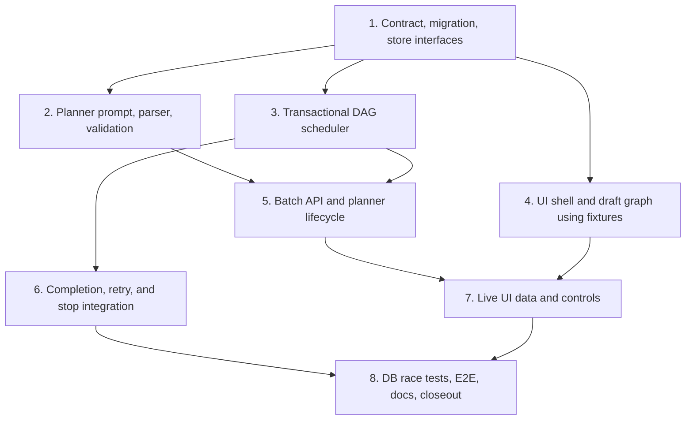

# [Product] Factory Batch — plan and execute a feature as a task DAG

## Outcome

A member gives Factory a feature brief and repository. Factory inspects the repository, proposes a bounded dependency graph of implementation tasks, lets the member review the plan, and then executes it automatically:

- all root tasks start when the batch starts, subject to a batch concurrency limit;
- completing one task queues every newly unblocked child;
- a child with several parents waits for all of them;
- independent children run in parallel as ordinary Factory tasks;
- failures block only their descendants while unrelated branches continue;
- the batch preserves every task thread, output, PR, retry, and dependency decision as an audit trail.

This is a product surface first. It is not a new generic workflow grammar or a hidden mode on `POST /api/jobs`.

## Product flow

1. Open **Batches → New batch**.
2. Choose repository, executor, task workflow, and maximum parallel tasks (default 3, bounded 1–8).
3. Enter the feature brief and select **Generate plan**.
4. Factory runs one code-owned planner task against the repository. The planner may inspect code but has gates and publish disabled.
5. A valid result opens as a draft graph. The member can edit task titles, prompts, acceptance criteria, and dependencies; add/remove tasks; or regenerate the plan.
6. **Start batch** validates and freezes the graph, then queues its root tasks.
7. The batch page renders topological stages: cards in the same stage are eligible to run in parallel. Each card links to its ordinary task thread and PR when present.
8. Successful task completion atomically releases newly ready children. A fan-in child is released only after every parent succeeds.
9. Failed, dead, stopped, or needs-attention tasks leave descendants visibly blocked. Unrelated active branches continue. **Retry** adds a follow-up to that task thread; a successful retry releases descendants exactly once.
10. The batch succeeds when every graph task succeeds. **Stop batch** stops queued/running task threads and marks never-started nodes stopped.

Planning never starts implementation automatically. The approval boundary between draft and running is deliberate.

## Architecture boundary

Factory Batch sits above the existing workflow engine:

- A workflow remains one sequential task thread, one shared worktree, and at most one live claim.
- Every batch graph node is a separate ordinary root task/thread. This is what permits real parallelism without weakening the one-worktree fence.
- Each node may run the selected workflow, including the default workflow and its PR/review steps.
- Batch dependency completion is evaluated only when the whole task thread is successfully done, not when one internal workflow row completes.
- Do not add multi-successor edges, joins, or batch state to `WorkflowDefinition`. Batch DAG validation and scheduling live in dedicated modules.
- The board schedules; the driver remains unaware of batches. Docker and Kubernetes receive ordinary claims and therefore keep executor parity.

### Source and branch semantics for v1

Each node owns an independent worktree/session/branch. A dependency controls scheduling and context; it does not silently merge a parent's branch.

The child receives bounded structured context for each parent: title, terminal summary, task link, stored PR identity/link when present, and output tail. The planner must parallelize only independently landable scopes. If several changes must be combined or verified together, it emits an explicit integration task depending on those parents. That task can inspect/fetch their PR refs and publish its own result. Factory Batch v1 does not auto-merge PRs, enable GitHub auto-merge, or promise one PR for the whole batch.

## Versioned plan contract

The planner's final output contains one strictly parsed, versioned JSON payload. Prose before/after it is ignored only when the delimiter is unambiguous; malformed or oversized output moves the batch to `planning_failed` and queues nothing.

```jsonc
{
  "version": 1,
  "title": "Short feature title",
  "tasks": [
    {
      "key": "persistence",
      "title": "Persist batch graphs",
      "prompt": "Concrete implementation prompt with ownership boundaries",
      "acceptance": ["Observable acceptance item"],
      "dependsOn": [],
      "scope": ["server/migrations", "server/src/db"]
    },
    {
      "key": "api",
      "title": "Expose batch lifecycle API",
      "prompt": "...",
      "acceptance": ["..."],
      "dependsOn": ["persistence"],
      "scope": ["server/src/routes"]
    }
  ]
}
```

Validation is server-owned and repeated on planner ingestion, every draft edit, and start:

- version exactly `1`; 1–20 tasks; unique stable keys matching the workflow-name style;
- bounded title, prompt, acceptance list/items, dependency count, and optional scope hints;
- dependencies name existing tasks; no self-edge, duplicate edge, or cycle;
- at least one root; all tasks participate in the graph; topological levels are deterministic;
- total serialized plan and generated child command stay within existing request/command bounds;
- unknown keys refuse with named error codes;
- draft mutations are optimistic-concurrency guarded by `planVersion`;
- start freezes the accepted plan; a running batch cannot be edited or regenerated.

The planner prompt requires implementation-sized tasks, explicit acceptance criteria, narrow ownership, minimal overlap between tasks in one parallel stage, and an integration task whenever parallel code changes need consolidation.

## Persistence and state

Add a new migration using the next available filename; never edit an applied migration.

### `factory_batch`

Stores `org_id`, id, creator, repo, feature brief, selected executor/workflow snapshot reference, concurrency limit, state, plan JSON/version, planner root job id, timestamps, and bounded planning error.

States: `planning`, `planning_failed`, `draft`, `running`, `needs_attention`, `stopping`, `stopped`, `succeeded`.

### `factory_batch_task`

Stores `org_id`, batch id, stable task key, frozen title/prompt/acceptance/scope, deterministic topological level/order, state, current root job id, attempt count, and timestamps.

States: `blocked`, `ready`, `queued`, `running`, `succeeded`, `failed`, `stopped`.

### `factory_batch_dependency`

Stores `(org_id, batch_id, task_key, depends_on_key)` with uniqueness and same-batch integrity. Index both dependency directions.

All reads and writes are organization-scoped. Job ids remain audit references without cascading deletion. Batch-owned task threads cannot be individually removed while the batch exists; the UI directs the member to stop the batch first.

## Scheduler semantics

Implement a pure DAG decision module plus transactional store wrapper.

- Starting a batch takes a per-batch advisory lock and creates ordinary root jobs for ready roots up to `maxParallel`.
- Completing a batch-owned task calls the scheduler only when the task thread is terminal. Under the same batch lock, it records the task outcome, computes capacity, and inserts every ready child up to capacity in one transaction.
- A task is ready iff all dependencies are `succeeded`, it has never been queued, and the batch is `running`.
- When capacity frees, deterministic order is `(topological_level, plan_order, task_key)`.
- Unique constraints/idempotency keys make repeated completion reports, retries, and concurrent parent completions unable to create duplicate root jobs.
- Concurrent fan-in parents may race, but only the completion that observes all parents succeeded can queue the child.
- A failed branch does not cancel unrelated running/queued work. When no work remains runnable and failures still block descendants, the batch becomes `needs_attention`.
- Retrying preserves the original task thread and history through a follow-up. It does not create a second graph node.
- Stop wins over scheduling: after `stopping`, no new task may be queued. Existing stop/lease fencing settles active jobs before the batch becomes `stopped`.
- Planner failure, graph validation failure, and task failure are product states, never background polling loops or silent rests.

## API

Add authenticated, organization-scoped routes with `Cache-Control: no-store`:

- `POST /api/batches` — validate repo/executor/workflow/feature and create the planner task; `201`.
- `GET /api/batches` — bounded newest-first summaries and state counts.
- `GET /api/batches/:id` — plan, task states, dependency edges, linked task summaries/PRs, and allowed actions.
- `PUT /api/batches/:id/plan` — replace a draft plan with `planVersion`; draft only.
- `POST /api/batches/:id/replan` — create a new planner attempt; not running.
- `POST /api/batches/:id/start` — validate/freeze and enqueue roots; idempotent.
- `POST /api/batches/:id/stop` — request stop across the batch; idempotent.
- `POST /api/batches/:id/tasks/:key/retry` — retry a failed/stopped task when its dependencies remain satisfied.

Use named `400` validation errors, `404` for an absent batch in the caller's organization, `409` for invalid state/version transitions, and `503` when the required store is unavailable. Never accept `org_id`, creator, task status, job ids, or planner output as client authority.

## UI

- Add **Batches** to desktop/mobile navigation and routes `/batches`, `/batches/new`, `/batches/:id`.
- Reuse existing page-header, card/panel, status, form, picker, dialog, and task-link primitives; update the design-system inventory for every new UI file/class.
- The list shows feature, repository, state, progress (`succeeded / total`), active count, and updated time.
- The composer explains that a plan is generated before work starts and exposes repo, executor, workflow, concurrency, and feature brief.
- The draft view is a stage list, not a free-form canvas: one row per topological level, task cards within it, explicit dependency labels, edit controls, validation errors, Regenerate, and Start.
- The running view uses the same stable layout with state, task/PR links, blocked reasons, Retry, and Stop. Status meaning is text plus color and remains keyboard/mobile accessible.
- A task detail linked from a batch shows a batch backlink and its graph key/dependencies without changing ordinary task behavior.

## Delivery graph

These are implementation work packages, with ownership chosen so Factory can parallelize safely after contracts land:



### 1. Contract, migration, store interfaces

Own the versioned plan types/refusal codes, tables/indexes, store interfaces, API response types, and fixture builders. Freeze the contract before downstream branches merge.

### 2. Planner prompt, parser, validation

Own the code-owned planner definition, bounded output extraction, pure DAG validation/topological leveling, regeneration behavior, and adversarial parser tests. No scheduling or UI work.

### 3. Transactional DAG scheduler

Own pure readiness/capacity decisions, advisory-lock transaction wrapper, idempotent root-job insertion, fan-out/fan-in, state aggregation, and concurrency/race database tests. No HTTP/UI work.

### 4. UI shell and draft graph using fixtures

Own routes/navigation, list/composer/draft components, responsive stage layout, accessibility, and render tests against frozen fixtures. May run in parallel with 2 and 3; merge after the API contract is stable.

### 5. Batch API and planner lifecycle

Own authenticated routes, planner job creation/completion ingestion, draft CRUD/start, org/repo/workflow validation, serialization, and route tests. Consumes 2 and 3.

### 6. Completion, retry, and stop integration

Own the narrow job-completion hook, whole-thread outcome mapping, retry-as-follow-up, batch stop fencing, and removal guard. Must preserve ordinary job/workflow behavior.

### 7. Live UI data and controls

Replace fixtures with API hooks, running progress, linked task/PR details, retry/stop actions, polling/invalidation, error states, and visual verification.

### 8. Integration and closeout

Own full database race coverage, planner-to-DAG-to-fan-out E2E, Docker/Kubernetes ordinary-claim parity, failure/stop/retry matrices, security/docs/API/design-system updates, and reviewed screenshots. Fix only demonstrated integration defects.

## Acceptance

- A feature brief becomes a valid, reviewable draft DAG; invalid planner output queues no implementation task.
- Start queues all roots up to capacity, and completing one parent atomically queues all newly eligible children.
- A fan-in child never starts early and starts exactly once after its final required parent succeeds.
- Parallel nodes are separate task roots/worktrees and can be claimed by different workers/executors.
- Each node runs its selected workflow normally; internal workflow transitions do not prematurely release batch children.
- Duplicate completion calls, concurrent parent completions, retries, stop races, and server restart do not duplicate or lose tasks.
- Failure blocks descendants, unrelated branches continue, retry can unblock the graph, and stop prevents new scheduling.
- Org/repo visibility and mutation authorization match ordinary tasks; no cross-organization batch or job reference is observable.
- Existing non-batch tasks, sequential workflows, claim fencing, publish behavior, and executor parity remain unchanged.
- The UI is usable on desktop/mobile, keyboard accessible, visually reviewed in both themes, and documents that dependencies do not auto-merge branches.

## Verification

- Pure plan parser/validator/scheduler unit tests.
- Disposable-DB integration tests for fan-out, fan-in, concurrency capacity, idempotency, retry, stop, and completion races.
- Route/auth/org/repo validation tests.
- Existing full `npm test`, `npm run typecheck`, and `npm run lint`.
- `npm run test:executors`, executor coverage gate, and `npm run test:k8s` proving batch tasks remain ordinary claims.
- Browser E2E from feature brief → draft approval → parallel execution → join → success, plus failure/retry and stop.
- `npm run verify:ui` with screenshots reviewed, not assertions alone.
